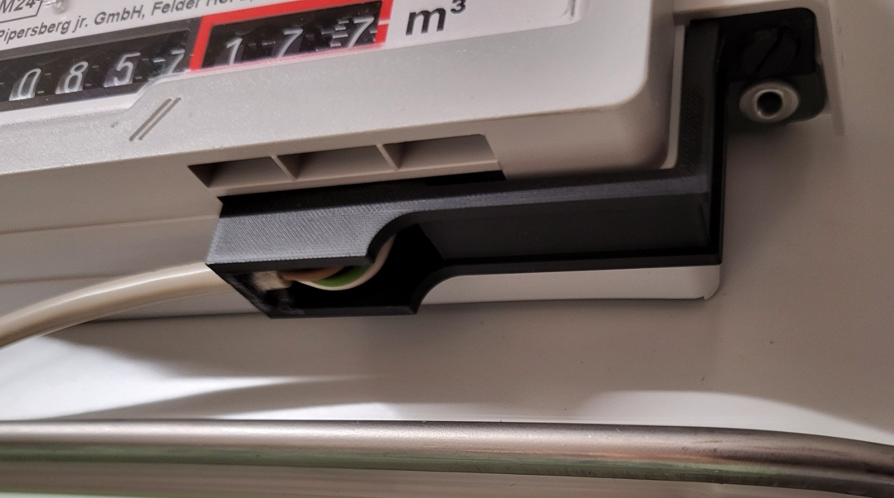
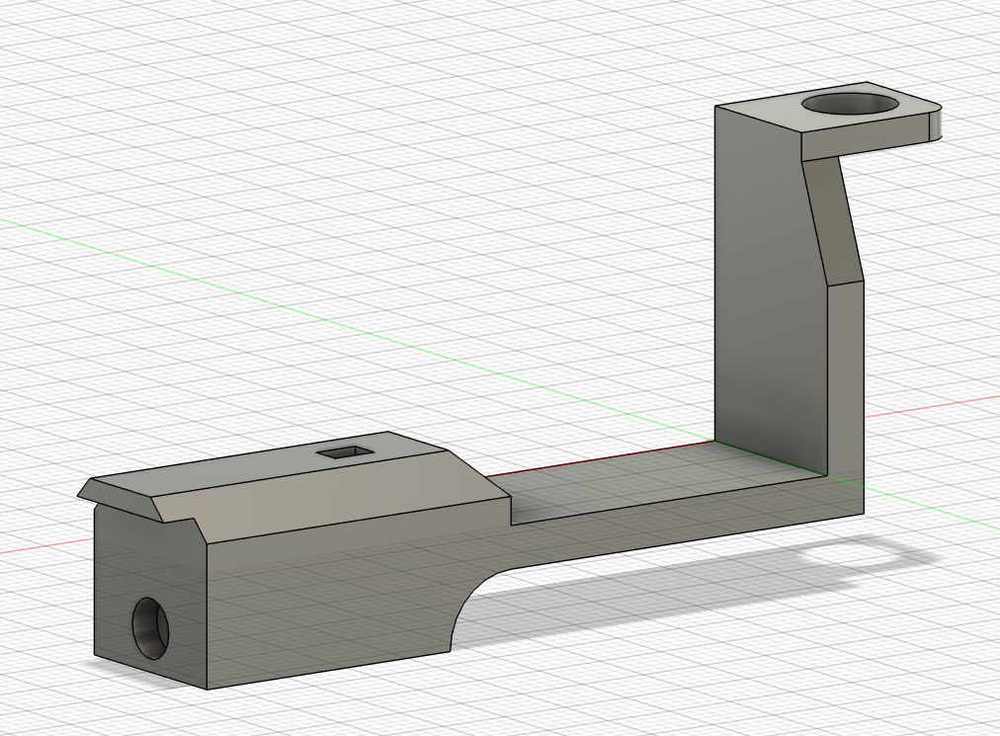

# Gas Meter Sensor

This repository contains a 3D model of a gas meter sensor mount.
The mount is designed to work with a **BK-G4T** gas meter and a **Honeywell SM353LT** hall sensor.

To read and publish the data to your home automation software,
you may use this [smart meter gateway](../smartmeter-gateway/).

## Overview

Finished sensor mounted to the gas meter:

3D model:

## Files

- [Fusion 360 3D model including STL and STEP files](./models/)

## License

All files are released under the GNU GPLv3.

Copyright 2024 Marius Greuel.
