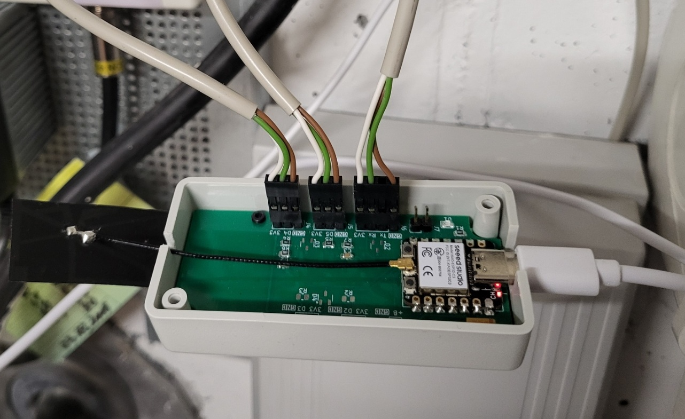
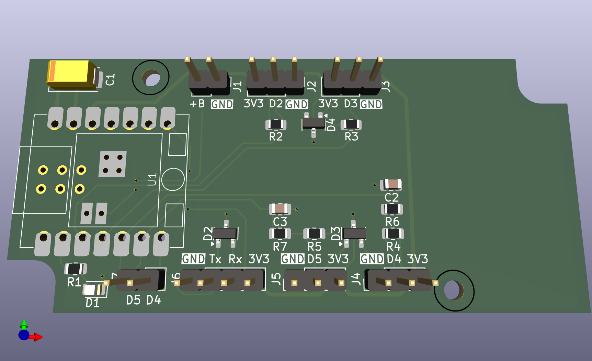
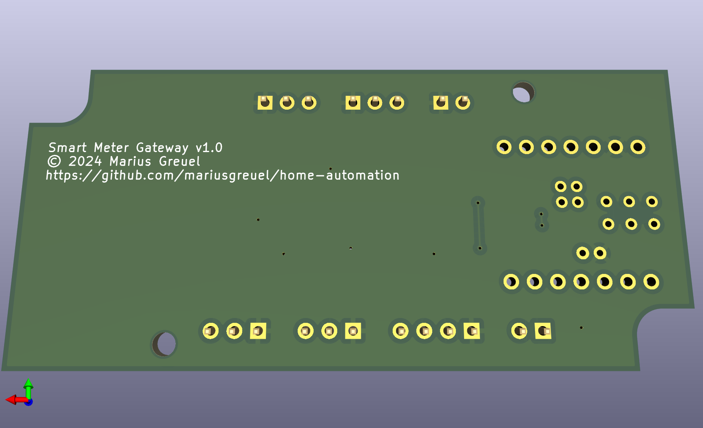

# Smart-Meter Gateway

This repository contains the KiCad schematic and PCB design of a smart-meter gateway.

The gateway includes multiple I/O ports, including a serial port for a smart meter reading head,
and some general purpose GPIO pins for hall sensors or other sensors.

The PCB is designed to work with a [Seeed Studio XIAO ESP32C3](https://wiki.seeedstudio.com/XIAO_ESP32C3_Getting_Started/),
and fits into a [Hammond 1551KGY](https://www.hammfg.com/part/1551KGY) enclosure.

The design includes optional components such as pull-up resistors or ESD protection diodes
that you may populate depending on your needs.

I use the [ESPHome](https://esphome.io/) firmware to read the data from the sensors and send it to my home automation system.

## Overview

Finished smartmeter gateway:



Front view of PCB:



Back view of PCB:



## Software

To read and publish the data to your home automation software,
you may use the [ESPHome](https://esphome.io/) firmware and the [Home Assistant](https://www.home-assistant.io/) software.

This repository contains an example configuration [`esphome/esphome-smart-meter.yaml`](./esphome/esphome-smart-meter.yaml) for the ESPHome software,
which includes the following features:

- Reading SML data from a smart meter reading head
- Reading data from a gas meter via a hall sensor
- Reading data from a water meter via a hall sensor
- Setting the initial value of the gas and water meters via the web interface

Note that you need to edit the ESPHome secrets file [`esphome/secrets.yaml`](./esphome/secrets.yaml)
and enter your WiFi credentials and generate new OTA and [API keys](https://esphome.io/components/api.html):

When you have [installed ESPHome](https://esphome.io/guides/installing_esphome.html) on your computer,
you can use the following command to install the firmware on your computer:

```console
esphome run esphome-smart-meter.yaml
```

When the smartmeter gateway is connected to your WiFi network, the device should be discovered automatically by Home Assistant.

## License

All files are released under the GNU GPLv3.

Copyright 2024 Marius Greuel.
