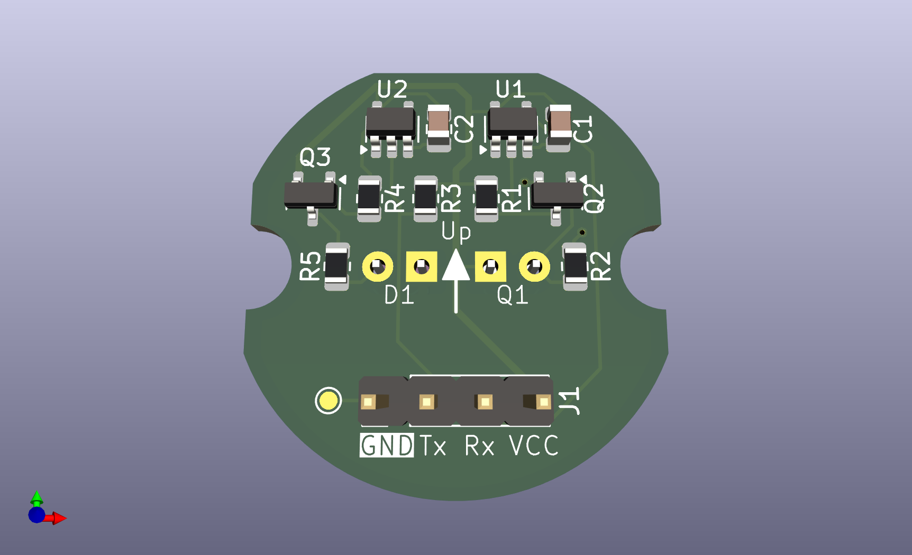
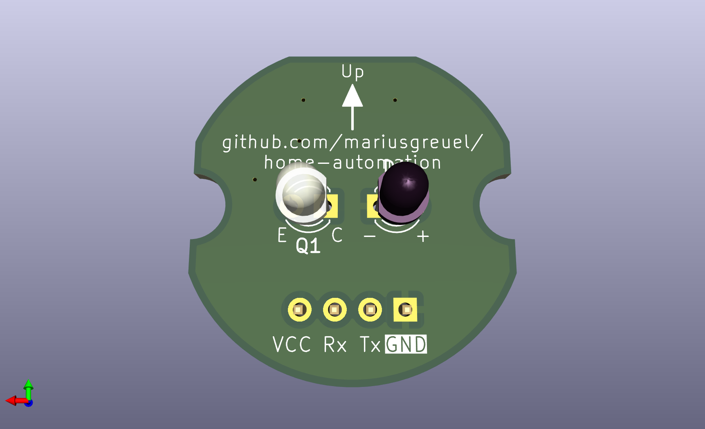
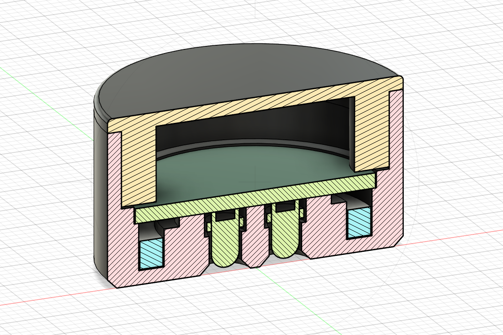

# Smart-Meter Reading Head

This repository contains the KiCad schematic and PCB design of a smart-meter reading head,
as well as a 3D model of the reading head.

The reading head is designed to be used for electricity meters following the IEC 62056-21 specification,
which includes an optical interface.

The PCB includes a serial port and runs on a 3.3V power supply.

To read and publish the data to your home automation software,
you may use this [smart meter gateway](../smartmeter-gateway/).

## Overview

Front view of PCB:

Back view of PCB:

Cut of reading head 3D printed model:

## Files

- [KiCad project](./pcb/)
- [Fusion 360 3D model including STL and STEP files](./models/)

## License

All files are released under the GNU GPLv3.

Copyright 2024 Marius Greuel.
